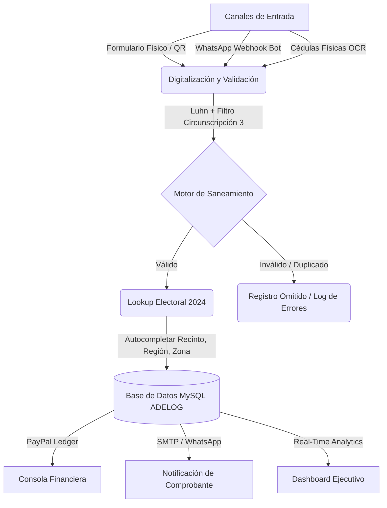

# ADELOG: Plataforma de Administración de Datos Electorales y Logística
### Presentación Ejecutiva y Ficha Técnica de Producto (B2B)

---

## 1. Visión General del Producto
**ADELOG** es una solución de software empresarial de alto rendimiento diseñada para la planificación, logística y auditoría en tiempo real de estructuras políticas y campañas electorales. 

La plataforma transforma los procesos tradicionales de captación de electores en flujos digitales automatizados y seguros, permitiendo a los comandos de campaña tomar decisiones basadas en datos estructurales y predictivos.

---

## 2. Pilares de Funcionalidad Clave

### 🛡️ Inteligencia Territorial y Saneamiento Activo
*   **Validación de Identidad por Luhn**: El sistema analiza algorítmicamente el dígito verificador de cada Cédula de Identidad y Electoral dominicana para impedir registros ficticios.
*   **Filtros Geográficos de Circunscripción**: Validación en caliente (frontend y backend) que bloquea cualquier elector cuya demarcación territorial no corresponda a la zona de postulación activa (por ejemplo, Circunscripción 3 de Santo Domingo), blindando la base de datos contra "data sucia".
*   **Lookup Electoral Automatizado**: A partir del código de Colegio Electoral, la plataforma cruza la base estructural histórica para rellenar de manera automática el Recinto, Región y Zona del elector, eliminando errores de digitación en campo.

---

### 👁️ Digitalización Acelerada por OCR (Inteligencia Artificial)
*   **Escaneo de Cédula a Doble Cara**: Mediante la integración de la API de Google Vision OCR, los operadores fotografían el frente y reverso de la cédula física del elector.
*   **Extracción de Textos**: El sistema procesa la imagen, lee la zona mecánica trasera (MRZ) y parsea automáticamente los nombres, apellidos, cédula, dirección, sector y municipio del ciudadano, poblando el formulario de registro en menos de 3 segundos.

---

### 💬 Asistente Virtual Interactivo (Bot de WhatsApp)
*   **Inscripción Autónoma**: Los ciudadanos inician su inscripción escaneando un código QR que los redirige a una conversación de WhatsApp gestionada por el bot interactivo de la plataforma.
*   **Flujo Conversacional Inteligente**: Guía paso a paso al votante recolectando datos, cruzando colegios y solicitando confirmación de datos antes del registro definitivo.
*   **Correcciones en Caliente**: Permite al usuario interactuar con el bot para actualizar variables específicas (por ejemplo, corregir un sector o colegio) sobre la misma conversación sin reiniciar el flujo.

---

### 📊 Dashboard Ejecutivo e Informes de Campaña
*   **Métricas e Indicadores Clave (KPIs)**: Visualización agregada de inscritos totales, registros por canal (manual, OCR, WhatsApp), incidencias de soporte abiertas y progreso individual de coordinadores.
*   **Comparativa Histórica y Metas**: Gráfico comparativo que contrasta los votos históricos del 2024 de la candidata con las metas e inscritos reales acumulados para el periodo 2028.
*   **Exportación Multiformato**: Descarga del padrón completo en plantillas Microsoft Excel preparadas para impresión, y generación de listados de firmas oficiales en PDF.

---

### 🔌 Consola de Configuración y Control Centralizado
*   **Personalización de Marca**: Permite al comprador redefinir en caliente el nombre de la candidata, el cargo postulado y las imágenes de los banners corporativos, actualizando dinámicamente todos los manuales descargables del sistema.
*   **Consola SMTP con Handshake en Vivo**: Interfaz interactiva de correo institucional con terminal de depuración que expone las respuestas del protocolo de correo en tiempo real para verificar la correcta salida de las notificaciones.
*   **Administrador de Flujos de Notificación**: Interruptores de encendido/apagado para controlar los disparadores de envíos de comprobantes automáticos e incidencias técnicas.
*   **Historial de Integración de APIs**: Monitor de estado de conexión y pruebas de ping para APIs externas (DGII y Google Cloud).

---

## 3. Malla de Privilegios por Rol (Seguridad Corporativa)
El sistema implementa un control de acceso basado en roles (RBAC) para proteger la confidencialidad de la información y prevenir la alteración o vaciado de registros:

| Módulo / Acción del Sistema | **Administrador** (Comando Central) | **Gerente** (Supervisión) | **Digitador** (Soporte Físico) | **Coordinador** (Líder en Campo) |
| :--- | :---: | :---: | :---: | :---: |
| **Acceso a Panel de Configuración** | Sí | **NO** | NO | NO |
| **Vaciado de Historiales de Chat** | Sí | **NO** | NO | NO |
| **Eliminación de Electores del Padrón**| Sí | **NO** | NO | NO |
| **Modificación de Permisos** | Sí | **NO** | NO | NO |
| **Creación de Campañas QR de Enlaces** | Sí | **Sí** | Sí | NO |
| **Edición / Registro de Votantes** | Sí | **Sí** | Sí | Sí |
| **Dashboard y Padrón Real-Time** | Sí | **Sí** | Sí | Solo Coordinados |

---

## 4. Motor ETL de Importación Masiva
Diseñado para la migración de padrones históricos provenientes de bases de datos externas o planillas de coordinadores de partidos aliados:
*   **Carga Drag & Drop**: Soporte para planillas de cálculo de gran tamaño (Excel y CSV).
*   **Mapeador Visual de Columnas**: Interfaz flexible donde el operador asocia las columnas del archivo de origen con la estructura oficial del sistema mediante menús desplegables.
*   **Procesamiento Asíncrono**: Motor que realiza la lectura, validación de Luhn, descarte de duplicados e inserción optimizada, registrando un log con los registros cargados con éxito y un reporte detallado de los omitidos.

---

## 5. Cumplimiento Normativo y Protección de Datos (Seguridad Jurídica)
Para garantizar la viabilidad legal y mitigar riesgos jurídicos, ADELOG está diseñado bajo estrictos parámetros de cumplimiento con el marco legal dominicano e internacional:

*   **Constitución de la República Dominicana (Art. 44 - Derecho a la Intimidad y Habeas Data):** Protege el derecho de los ciudadanos sobre sus datos personales. La plataforma implementa validación de consentimiento y consulta transparente de registros.
*   **Ley No. 172-13 sobre Protección de Datos de Carácter Personal (República Dominicana):** ADELOG cumple con los principios de **finalidad** (datos utilizados exclusivamente para logística electoral interna), **confidencialidad** (acceso cifrado y segmentado) y **seguridad** del dato personal, evitando la alteración, pérdida o tratamiento no autorizado.
*   **Ley No. 53-07 sobre Crímenes y Delitos de Alta Tecnología:** Medidas activas contra sabotajes y fugas de datos:
    *   *Cifrado de Credenciales*: Contraseñas de usuarios almacenadas con algoritmos de hashing robustos (Bcrypt).
    *   *Bitácora de Auditoría Completa*: Registro inalterable en base de datos (`logs_auditoria`) con fecha, hora, usuario e IP de cada acción crítica (creación de usuarios, cambios de permisos, descargas de padrones).
    *   *Seguridad contra Inyección SQL*: Consultas parametrizadas y preparadas en el motor PHP.
*   **Ley No. 20-23 Orgánica del Régimen Electoral (República Dominicana):** Alineado con las normativas vigentes sobre logística, registro transparente de simpatizantes y gestión de delegados ante colegios electorales sin vulnerar el secreto del voto.
*   **Alineamiento GDPR / ISO 27001:** Adopción de buenas prácticas de minimización de datos (captura exclusiva de campos necesarios para fines logísticos) e incriptación SSL/TLS para la comunicación de correos electrónicos y webhook APIs.

---
> **Ficha Técnica de Infraestructura:**
> Desarrollado bajo arquitectura web SPA (Single Page Application) ligera con backend PHP modulado y base de datos relacional MySQL optimizada para un alto volumen de transacciones concurrentes. Totalmente compatible con despliegues locales (WampServer/XAMPP) y servidores cloud dedicados.
