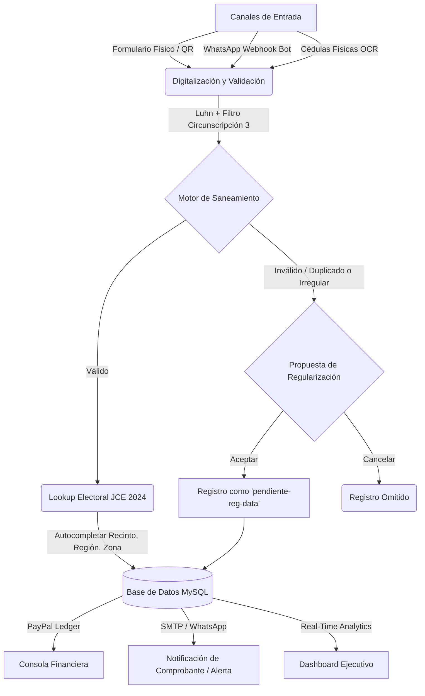

# ADELOG: Plataforma de Administración de Datos Electorales y Logística
> **Solución Empresarial B2B de Alto Rendimiento para Campañas Electorales y Auditoría Logística**

[](https://opensource.org/licenses/MIT)
[](https://www.php.net/)
[](https://www.mysql.com/)
[](https://www.python.org/)

---

## 📋 Visión General

**ADELOG** (Administración de Datos Electorales y Logística) es una suite de software integral diseñada para automatizar, validar y auditar en tiempo real la captación de electores y la estructura operativa en campañas electorales. 

La plataforma reduce los tiempos de captura, elimina la "data sucia" mediante reglas estrictas de integridad y proporciona un centro de control unificado con dashboards analíticos, auditorías inalterables de acciones y sincronización segura de copias de respaldo.



---

## 🚀 Pilares y Funcionalidades Clave

### 🛡️ Malla de Integridad Territorial y Saneamiento Activo
*   **Algoritmo Luhn Dominicana**: Validación matemática en caliente de la Cédula de Identidad y Electoral para bloquear registros inexistentes.
*   **Filtro Geográfico Estricto**: Restricción a nivel de API para que solo se inscriban votantes que pertenezcan a la delimitación permitida (ej: *Santo Domingo Este Circunscripción 3, Boca Chica, Guerra, San Luis, La Caleta*).
*   **Conciliación Estructural (COEL)**: Si el Colegio Electoral del elector no existe o se reporta irregular respecto al padrón oficial de la JCE 2024, el sistema propone registrarlo en el estatus especial `pendiente-reg-data` (Pendiente de Regularización) y notifica al elector, a su coordinador y a la auditoría técnica.

### 👁️ Digitalización Asistida por IA (Google Vision OCR)
*   **Lectura MRZ**: Extracción e interpretación automática de la zona de lectura mecánica (MRZ) trasera de la cédula física para autocompletar nombres, apellidos, cédula y dirección en menos de 3 segundos.
*   **Heurística Frontal**: Extracción de textos complejos y segmentación automática de campos para fotos de cédula de baja definición.

### 💬 Asistente Virtual Interactivo (Bot de WhatsApp)
*   **Auto-inscripción Móvil**: Generador dinámico de códigos QR para que los ciudadanos se registren directamente interactuando con un chatbot automatizado.
*   **Edición Dinámica**: Flujo conversacional bidireccional que permite corregir datos puntuales (colegio, sector) sin tener que reiniciar la captura.

### 📊 Dashboard Ejecutivo e Inteligencia Comercial
*   **KPIs en Tiempo Real**: Gráficos dinámicos que comparan el avance del padrón con las metas electorales de la candidata y las estadísticas históricas del 2024.
*   **PayPal Ledger**: Módulo contable que registra transacciones por compras de licencias de promotores, desglosando brutos, comisiones y saldos netos.
*   **Notificaciones Premium**: Plantillas de correo institucional (SMTP) con depuración visual del protocolo en tiempo real.

---

## 🔒 Seguridad, Privacidad y Cumplimiento Normativo

Para mitigar riesgos legales y garantizar la viabilidad del proyecto, ADELOG incorpora controles alineados con la legislación dominicana y estándares internacionales:

*   **Constitución Dominicana (Art. 44 - Habeas Data)**: Consentimiento explícito de uso de datos.
*   **Ley No. 172-13 sobre Protección de Datos Personales**: Principios de finalidad exclusiva para logística y resguardo seguro. El repositorio de Git **no contiene datos sensibles de los electores**, subiendo únicamente esquemas de base de datos vacías y semillas estructurales.
*   **Ley No. 53-07 sobre Crímenes y Delitos de Alta Tecnología**:
    *   *Cifrado Bcrypt* para todas las contraseñas.
    *   *Logs de Auditoría Inalterables* que registran usuario, acción, IP y marcas de tiempo de cada evento crítico.
    *   *Consultas Parametrizadas* para anular ataques de Inyección SQL.

---

## 📂 Estructura del Proyecto

```text
├── backend/
│   ├── api/                  # APIs de Gestión (voters, auth, settings, ocr, helpdesk)
│   ├── libs/                 # Librerías auxiliares (PHPMailer, etc.)
│   ├── backups/              # Destino local de respaldos SQL de la plataforma
│   ├── db.php                # Inicializador de la conexión PDO/MySQL (Singleton)
│   └── Mailer.php            # Motor centralizado de correos con logging SQL
├── frontend/
│   ├── assets/               # Hojas de estilo CSS (styles.css), JavaScript (app.js) e iconos
│   ├── dashboard.html        # Consola de Control de Administradores
│   ├── index.html            # Portal público de auto-registro QR
│   └── login.html            # Portal de acceso seguro
├── README.md                 # Ficha técnica oficial
└── .gitignore                # Reglas de exclusión para credenciales de producción (config.php)
```

---

## ⚙️ Instalación y Configuración Local

### Requisitos Previos
*   **Servidor Web**: WampServer, XAMPP o Laragon (PHP >= 8.0, MySQL >= 8.0).
*   **Python**: Python 3.10 o superior (para ejecutar el Motor ETL).
*   **Acceso a Internet**: Opcional (el sistema cuenta con contingencia y simulación sin conexión para el validador de DGII y Google Vision).

### Pasos de Despliegue

1.  **Clonar el Repositorio**:
    ```bash
    git clone https://github.com/jhenri27/ADELOG-PLATAFORMA-DIGITAL-PAD-28-32.git
    cd ADELOG-PLATAFORMA-DIGITAL-PAD-28-32
    ```
2.  **Configurar Variables de Base de Datos**:
    *   Copia el archivo `backend/config.example.php` y renombralo como `backend/config.php`.
    *   Introduce tus credenciales locales de MySQL:
        ```php
        define('DB_HOST', 'localhost');
        define('DB_USER', 'tu_usuario');
        define('DB_PASS', 'tu_contraseña');
        define('DB_NAME', 'tu_base_datos');
        ```
3.  **Ejecutar Instalador**:
    *   Abre tu navegador web y dirígete a: `http://localhost/ADELOG-PLATAFORMA-DIGITAL-PAD-28-32/backend/install.php`.
    *   Esto creará las tablas necesarias e inyectará los usuarios por defecto y los datos estructurales del padrón.

---

## 💾 Respaldo y Despliegues

La plataforma cuenta con un panel de control técnico interactivo en **Configuración > Copias y Despliegues** que permite:

1.  **Copia de Seguridad**:
    *   Genera un archivo `.sql` con la estructura completa del sistema y tablas de configuración.
    *   Realiza un **espejo de código** copiando todas las carpetas del proyecto (`backend`, `frontend`, gráficos, etc.) directamente hacia el disco externo montado en `F:\ADELOG\PLATAFORMA DIGITAL-PAD-28-32`.
2.  **Sincronización Git (Push Update)**:
    *   Crea un commit automático local y empuja los cambios fuente a tu repositorio remoto de GitHub con un solo clic.

---
Desarrollado para la administración de logisticas de comandos de campañas en RD, por sypempresariales . Copyright © 2026 Sypempresariales.
