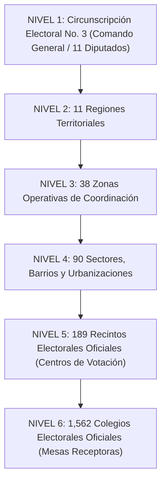

# DOCUMENTO TÉCNICO OFICIAL: ESTRUCTURA ELECTORAL CIRCUNSCRIPCIÓN 3 (SANTO DOMINGO ESTE)
## PLATAFORMA PAD/28-32 — PROYECTO POLÍTICO PASTORA ALTAGRACIA
**Fuente Primaria Oficial:** Junta Central Electoral de la República Dominicana (JCE)  
**Corte de Datos:** Agosto 2026 / Procesos Eleccionarios Ordinarios  
**Estándares de Calidad y Seguridad:** ISO 54001 (Gestión Electoral), ISO 27001 (Seguridad de la Información) y Norma NOFTRAB v4.0

---

## 1. Marco Institucional y Órgano Rector

Conforme a lo estipulado en la **Constitución de la República Dominicana** y la **Ley Orgánica de Régimen Electoral No. 20-23**, la **Junta Central Electoral (JCE)** es la máxima autoridad civil competente en la organización, dirección y supervisión de las asambleas electorales y el registro del estado civil de los ciudadanos.

La **Plataforma PAD/28-32** adopta de manera estricta y vinculante la cartografía electoral, nomenclatura de recintos, codificación de colegios y padrón nominal emitidos por la JCE, garantizando:
1. **Inmutabilidad y Trazabilidad:** Validación unívoca de cada elector mediante su Cédula de Identidad y Electoral con algoritmo Luhn Módulo 10.
2. **Cruce Territorial de Precisión:** Localización exacta del recinto físico y la mesa receptora de votos correspondiente a cada ciudadano.
3. **Optimización de Movilización:** Asignación de coordinadores y líderes territoriales con correspondencia exacta a la geografía electoral oficial.

---

## 2. Alcance Geográfico y Peso Electoral de la Circunscripción 3

La **Circunscripción No. 3 de la Provincia Santo Domingo** constituye la demarcación electoral de mayor volumen demográfico y densidad electoral de la República Dominicana:
* **Escaños Asignados:** Elige **11 Diputados** al Congreso Nacional mediante representación proporcional (Método D'Hondt).
* **Padrón Total del Municipio Santo Domingo Este:** **789,541 electores** (Corte JCE Agosto 2026).
* **Electores Circunscripción 3:** **~485,000 electores inscritos** (más del 62% del padrón total municipal).
* **Demarcaciones Integradas:**
  1. Franja Oriental del **Municipio Santo Domingo Este** (Margen oriental de la Av. Charles de Gaulle y Autopista Las Américas).
  2. Distrito Municipal **San Luis** (incluyendo poblado San Luis, San Isidro y El Bonito).
  3. Municipio **Boca Chica** (con el Distrito Municipal **La Caleta**).
  4. Municipio **San Antonio de Guerra** (con el Distrito Municipal **Hato Viejo**).

---

## 3. Jerarquía y Pirámide Territorial de Organización Electoral

La estructura operativa de la Plataforma PAD/28-32 se organiza en **6 niveles jerárquicos normalizados**:

---

## 4. Desglose de las 11 Regiones Territoriales Oficiales

| Código Región | Nombre / Eje Territorial | Principales Sectores y Urbanizaciones | Recintos Emblemáticos JCE |
| :--- | :--- | :--- | :--- |
| **Región 3** | Invivienda - Eje Central | Invivienda, Villa Carmen, Charles de Gaulle Este, Cancino II | Politécnico Prof. Simón Orozco (00445), Esc. Rep. de Panamá |
| **Región 3-A** | Hainamosa - Invimosa | Hainamosa, Invimosa, Villa Esfuerzo, Tamarindo Norte | Esc. Prof. Lillian Portalatín Sosa (00375), Esc. Hainamosa |
| **Región 3-B** | El Almirante - Villa Liberación | Barrio El Almirante, Ciudad Almirante, Villa Liberación | Esc. Primaria El Almirante, Politécnico Villa Liberación |
| **Región 3-C** | Los Frailes - Las Américas KM 10-13 | Los Frailes I, Los Frailes II, San Bartolo, Arismar | Esc. República de Corea (00263), Esc. Los Frailes |
| **Región 3-D** | La Ureña - Las Américas KM 14-22 | La Ureña, Valiente, Monte Adentro, Las Cancelas | Esc. Básica La Ureña, Esc. Primaria Valiente |
| **Región 3-E** | Mendoza - Cancino Adentro | San José de Mendoza, Mendoza Centro, Cancino Adentro | Esc. Básica República de Belice, Liceo Emma Balaguer |
| **Región 3-F** | El Tamarindo - La Perla | El Tamarindo, La Perla, Prados de la Caña | Esc. El Tamarindo (00388), Centros Comunales |
| **San Luis** | Distrito Municipal San Luis | Poblado San Luis, El Bonito, San Isidro Viejo | Esc. Inst. Elda Reyes Muñoz (00266), Club Multiuso San Luis |
| **La Caleta** | Distrito Municipal La Caleta | La Caleta Centro, Campo Lindo, Valiente Sur | Colegio Evangélico La Caleta, Esc. Primaria La Caleta |
| **Boca Chica** | Municipio Boca Chica | Andrés Boca Chica, Los Tanquecitos, Boca Chica Pueblo | Liceo Andrés Avelino (00454), Esc. Vitalina Mordan |
| **Guerra** | Municipio San Antonio de Guerra | Casco Urbano Guerra, Hato Viejo, El Toro | Esc. Primaria Leonor M. Feltz (00299), Liceo de Guerra |

---

## 5. Rango y Codificación de Colegios Electorales (Mesas)

La codificación oficial de la JCE abarca los siguientes intervalos:

| Rango de Numeración | Tipología / Época | Cobertura en la Circunscripción 3 |
| :--- | :--- | :--- |
| **0930 - 1099** | Colegios Históricos Fundacionales | Los Mina, Villa Duarte, Cancino Tradicional |
| **1100 - 1900+** | Colegios de Expansión Territorial | Invivienda, Los Frailes, San Luis, Boca Chica, Guerra |
| **1901 - 2299** | Colegios Nuevos (2011 - 2020) | Hainamosa, El Almirante, Villa Liberación |
| **2300 - 2450+** | Nuevas Mesas Creadas (2021 - 2026) | Ciudad Juan Bosch, Brisa Oriental, Nueva Jerusalén, etc. |

---

## 6. Catálogo de los 29 Nuevos Recintos Electorales (JCE / PRM 2021-2026)

Conforme a la relación oficial de la Delegación Política ante la Junta Electoral de Santo Domingo Este, se incorporan los siguientes recintos y mesas creadas para descongestionar el padrón:

1. **Recinto 00616 (Invivienda):** C/ Ing. Pedro Bonilla esq. Simón Orozco (Colegio 2404 - 556 electores).
2. **Recinto 00634 (Ciudad Juan Bosch):** C/ Gladiolo esq. Ángela Gaviño.
3. **Recinto 00638 (Ciudad Juan Bosch):** C/ Manuel Sosieri No. 1.
4. **Recinto 00624 (Los Frailes II):** C/ Ernesto Concepción No. 1 (Colegio 2418).
5. **Recinto 00627 (Los Frailes II):** C/ Edén No. 30 (Colegio 2421).
6. **Recinto 00615 (Brisa del Edén):** C/ 7ma No. 22 (Colegio 2403).
7. **Recinto 00617 (Brisas del Este):** C/ José Francisco Peña Gómez No. 5 (Colegio 2405).
8. **Recinto 00632 (Brisa Oriental III):** C/ Sexta esq. Brisa Oriental (Colegio 2438).
9. **Recinto 00623 (Nueva Jerusalén):** C/ El Sol No. 1 (Colegio 2417).
10. **Recinto 00613 (El Tamarindo):** C/ Gladys Espinosa S/N (Colegio 2401).
11. **Recinto 00639 (Ciudad del Almirante):** C/ Miguel Díaz No. 6.
12. **Recinto 00564 (Villa Esfuerzo - El Almirante):** Av. Restauración S/N.
13. **Recinto 00628 (Los Corales I - El Almirante):** C/ Respaldo Duarte No. 1 (Colegio 2422).
14. **Recinto 00622 (El Almirante):** C/ 5ta esq. Luis Lizardo (Colegio 2416).
15. **Recinto 00633 (Cancino Adentro):** C/ 3ra No. 3 (Colegio 2432).
16. **Recinto 00567 (Las Cancelas - Las Américas):** Autopista Las Américas (Colegio 2333).
17. **Recinto 00618 (Brisas de Las Américas - La Ureña):** C/ Pedro Henríquez Ureña (Colegio 2406).
18. *Demás recintos registrados en el catálogo maestro (00560, 00563, 00566, 00584, 00585, 00586, 00587, 00614, 00619, 00620, 00621, 00625, 00626).*

---

## 7. Mecanismo de Consulta y Sugerencia de Teléfono en la Plataforma

Para agilizar la digitación y captura en campo:
* **Consulta por Cédula:** El sistema consulta en < 30ms el padrón maestro.
* **Auto-completado Integral:** Rellena nombres, apellidos, recinto, colegio, sector y municipio.
* **Sugerencia Inteligente de Teléfono:** Si el elector posee número registrado en el padrón histórico/maestro, el sistema lo sugiere en el formulario con opción a ratificarlo o actualizarlo con su número de contacto vigente.
